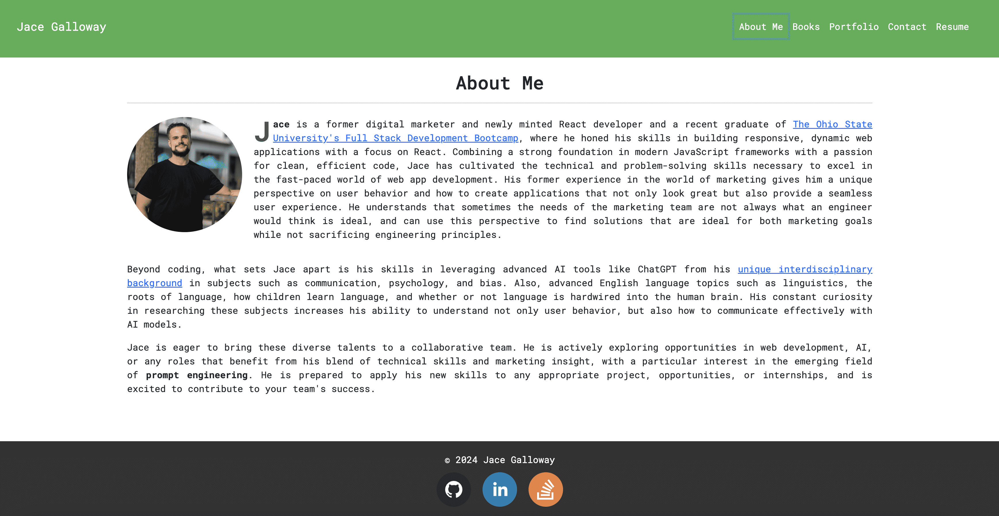

# React Portfolio

## Description

This is a single-page application portfolio built using React. It showcases my skills and projects, providing a user-friendly interface to navigate through different sections. The portfolio includes sections for About Me, Projects, Contact, and Resume.

## Table of Contents

-   [Usage](#usage)
-   [Contributing](#contributing)
-   [Questions](#questions)
-   [Credits](#credits)
-   [Preview](#preview)

## Usage

To use this application, simply goto [https://thunderous-tapioca-0a8ebe.netlify.app/](https://thunderous-tapioca-0a8ebe.netlify.app/)

Wait roughly 60 seconds for the bookshelf page to load to see a list of books I've read relevant to my experience.

## Contributing

Contributions are somewhat welcome. Please submit a pull request or open an issue for any feature requests or bugs.

## Questions

For any questions, please contact me at jace.galloway@gmail.com. You can also find my GitHub profile at [JaceG](https://github.com/JaceG).

## Credits

Credits: This project was created as part of a coding bootcamp challenge. - Sources and References: Portions of the code and guidance were provided with assistance from ChatGPT, Tutors, and my Instructors.

## Preview

